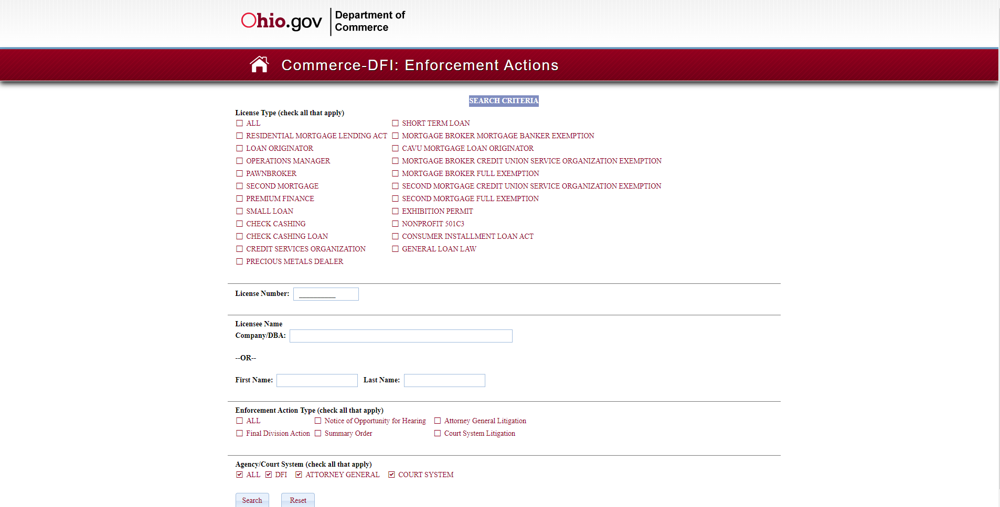

# Automating Downloads from Government Search Portals (Ohio)
The Ohio Department of Commerce stores their Enforcement Actions on a web search portal that had to be searched through and matched against our local CSV list of MEAs issued in Ohio from 2000-2010. As there were over 6900 entries to look through, manual search proved to be a slow and tedious affair. The Selenium script written shortened the process that originally was thought to take 2 weeks to 10 hours.

## Usage
---
1. Download the scripts into a directory
2. Create a virtual environment and install ``requirements.txt``
   * Conda
     * ``conda create --name <environment name> python``
     * ``conda activate <environment name>``
     * ``conda install -file requirements.txt``
   * Pip
     * ``pip install -r requirements.txt``
3. Create a ``Scraped Files`` folder in the same directory
4. Rename 
   * Excel Constants
   * Webpage Constants
   * Filepaths
5. Adjust XPaths, Class and Name identifiers
6. Rework logic for parsing through web page
7. Run program. Set download folder in browser during pause. Press enter again.
8. Wait until program has completed running
9. Complete additional processing
   * Change word documents to PDFs with ``convert.py``
> Note: Empty ``WordDocs`` folder first.

## Technologies
---
Project is created with:
- Selenium
- OpenPyxl
- Pandas
- Python-Docx