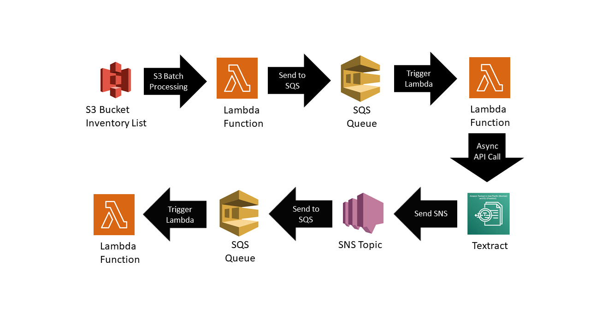

# Extracting Text from PDFs with AWS (Ohio)
Over 6300 PDFs of Mortgage Enforcement Actions (MEAs) were stored in an Amazon S3 Bucket. This integrated AWS workflow processes the text of all of them and store them to the corresponding MEA case in the CSV.

## Workflow
---

## Lambda Functions
---
1. S3BatchProcessing
   * Receives Lambda invocation from S3 Batch Processing and sends bucket name and object name to SQS queue.
2. SQS_To_Textract
   * Polls SQS queue for bucket names and object names and sends asynchronous API call to Textract to start processing.
3. Textract_To_Text
   * Receives SQS message triggered by SNS subscription of completed Textract jobs and processes text to a CSV file.

## Usage
1. Fork GitHub repo and clone into AWS Cloud9.
2. Rename
   * Path, SNS Topic and SQS Queue URLs in Constants section of Lambda Functions
   * Policy Names (S3 Bucket, SQS Queue, SNS Subscription)
3. Deploy the Lambda functions
   * Navigate to Lambda function directory
   * ``sam build``
   * ``sam deploy --guided``
4. Generate inventory manifest for list of PDFs in folder.
> Note: This process can take up to 48 hours the first time.
5. Prepare S3 Batch Operations
   * Select <b>Manifest Format: S3 Inventory Report</b> (Select the ``manifest.json`` file created earlier.)
   * Select <b>Invoke AWS Lambda function</b>
   * Select <b>Choose from functions in your account</b> and select <b>s3batchprocessing</b>
   * Fill in Path to Completed Report
   * Select <b>Choose from existing IAM roles</b> and select <b>s3batchprocessing-operations</b>
   * Create Job
6. Go to SQS_To_Textract Lambda function and set trigger to SQS queue pushed to by S3BatchProcessing.
7. Go to Textract_To_Text Lambda function and set trigger to SQS queue subscribed to by SNS Topic.
8.  Run Job Created
9.  Go to Cloud 9, create a folder in a directory, record the path and download all parsed CSVs to folder with ``aws s3 sync s3://<source_bucket> <local_destination>`` on the command line.
10. Rename paths in ``collect_extracted_files.py`` file and run file.
> Note: Most problems in running this workflow will primarily either be faulty pathnames/ARNs/SQS URLs, or permission errors. Make sure to check the paths in the Lambda functions and check the Roles and Policies in AWS IAM.

## Technologies
---
Project is created with:
- AWS SDK
- Boto3
- S3
- S3 Batch Operations
- Lambda
- Simple Queue Service (SQS)
- Simple Notification Service (SNS)
- Identity and Access Management (IAM)